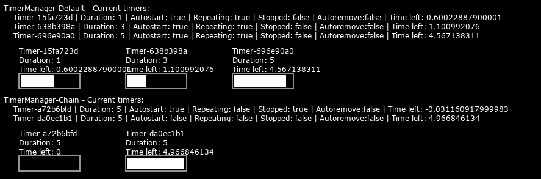

# Timer manager for Love2D

## About

This is a timer library for Love2D.
Allows you to keep all timers in one place and allows you to control and update all created timers at once. Can also be used anywhere by [altering timerManager.lua](#using-timer-manager-in-places-besides-love2d)

## Table of contents

- [Timer manager for Love2D](#timer-manager-for-love2d)
  - [About](#about)
  - [Table of contents](#table-of-contents)
  - [Preview](#preview)
  - [Downloading](#downloading)
  - [Using timer manager in places besides Love2D](#using-timer-manager-in-places-besides-love2d)
  - [Documentation](#documentation)
    - [timer.lua](#timerlua)
      - [Description](#description)
      - [Fields](#fields)
        - [Generated fields:](#generated-fields)
        - [User fields (settings table):](#user-fields-settings-table)
      - [Methods:](#methods)
      - [Metamethods](#metamethods)
      - [How-to initialize](#how-to-initialize)
    - [timerManager.lua](#timermanagerlua)
      - [Description](#description-1)
      - [Fields](#fields-1)
        - [Generated fields](#generated-fields-1)
        - [User fields (settings table)](#user-fields-settings-table-1)
      - [Methods](#methods-1)
      - [Metamethods](#metamethods-1)
      - [How-to initialize](#how-to-initialize-1)
  - [Contributing](#contributing)
  - [TO-DO](#to-do)
  - [Fun things](#fun-things)
    - [#1 - Timers created in random order](#1---timers-created-in-random-order)

## Preview



## Downloading 

```sh
git clone https://github.com/msun-dev/lua_love2d_timerManager
```

Remove all unneeded files afterwards.

Or use something like [downgit](https://downgit.github.io/#/home) to download a single folder.

## Using timer manager in places besides Love2D

In timerManager.lua change line #47:
```lua
47: local s = love.math.random(0, 0xf) -- This line should be changed
```

For example, using lua math library you can do this:
```lua
+4: local seed = os.time() -- Add it before all initializations
47: local s = math.random(0, 0xf) -- Change to your preferred method
```

## Documentation

Timers related documentation. How timers and timerManager work, methods, how to initialize, etc. Everything that is somewhat related to timers.

### timer.lua

#### Description

Main object that executes user-defined callback after some amount of time. Used by timerManager.lua.

#### Fields

##### Generated fields:

- ```uuid``` - Default value: ```""```. Value generated when initialized by timer manager.
- ```time_left``` - Default value: ```0```. Shows the time left until ```callback``` execution.  
- ```stopped``` - Default value: ```true```. Becomes ```true``` when ```time_left``` reaches 0. Timer doesn't update when ```stopped``` equals ```true```.

##### User fields (settings table):  
- ```duration``` - Default value: ```1```. Duration of the timer in seconds.
- ```autostart``` - Default value: ```true```. If ```true```, the timer will start automatically on initialization.
- ```repeating``` - Default value: ```false```. Timer will automatically start again after ```time_left``` reaches 0.
- ```autoremove``` - Default value: ```false```. Timer manager will automatically remove this timer if this field is set to ```true``` and ```time_left``` reaches 0.  
- ```callback``` - Default value: ```false```. The timer automatically executes this function when ```time_left``` reaches 0.


#### Methods:

- ```.new(settings)```
    - Description: Creates new timer object.
    - Parameters: ```settings``` - Settings table for timer. See [timers user fields](#user-fields-settings-table) for possible options.
    - Returns: ```table```

- ```:get_timeleft()```
    - Description: Returns value of ```time_left``` field.
    - Parameters: ```none```
    - Returns: ```number```

- ```:get_duration()```
  - Description: Returns value of ```duration``` field.
  - Parameters: ```none```
  - Returns: ```number```

- ```:get_uuid```
  - Description: Returns value of ```uuid``` field.
  - Parameters: ```none```
  - Returns: ```string```

- ```:set_duration(value)```
    - Description: Sets the duration of a timer.
    - Parameters: ```value``` - duration in seconds.
    - Returns: ```nothing```

- ```:is_stopped()```
    - Description: Returns value of ```stopped``` field.
    - Parameters: ```none```
    - Returns: ```boolean```

- ```:start()```
    - Description: Starts the timer.
    - Parameters: ```none```
    - Returns: ```nothing```

- ```:stop()```
    - Description: Stops the timer.
    - Parameters: ```none```
    - Returns: ```nothing```

- ```:execute()```
    - Description: Executes user-definend callback.
    - Parameters: ```none```
    - Returns: ```nothing```
 
- ```:update(delta)```
    - Description: Update timer by delta between frames. Used by timer manager.
    - Parameters: ```delta``` - time between frames.
    - Returns: ```nothing```

#### Metamethods

- ```:__index()```
    - Description: Returns string representation of the timer.
    - Parameters: ```none```
    - Returns: ```string```

- ```:__add(value)```
    - Description: Add time to ```time_left```
    - Parameters: ```number``` - seconds to be added to ```time_left```
    - Returns: ```nothing```

- ```:__sub(value)```
    - Description: Remove time from ```time_left```
    - Parameters: ```number``` - seconds to subtract from ```time_left```
    - Returns: ```nothing```

#### How-to initialize
With timer manager (assuming you've already initiated timerManager in variable ```TimerManager```):
```lua
require("timer")

Timer = TimerManager:create_timer({ -- TimerManager returns uuid of the timer
    duration = 1,                   -- So you can get a timer using this value
    autostart = true,               -- in TimerManager:get_timer(uuid)
    repeating = true,
    autoremove = true,
    callback = function() print("One second has passed!") end
})
```

Without timer manager (need manually update delta in every timer): 
```lua
Timer_1sec = Timer.create_timer({
    duration = 1,
    autostart = true,
    repeating = true,
    autoremove = true,
    callback = function() print("One second has passed!") end
})

-- Pseudo main loop
function loop(delta) -- delta is a time between frames
    Timer_1sec:update(delta)
end
```

---

### timerManager.lua

#### Description

Manages timers. Allows you to keep all timers in one place and allows you to control and update all created timers at once. Timers are created with unique UUID so you can easily access them by using ```:get_timer(uuid)```. 

#### Fields

##### Generated fields

- ```timers``` - Default value: ```{}```. Table of timers. The manager keeps them all there. 

##### User fields (settings table)

- ```name``` - Default value: ```TimerManager```. Name of timer manager. Every manager should have a name, right? 

#### Methods

- ```.new()```
    - Description: Creates new timer manager object.
    - Parameters: ```settings``` - Settings table for timer manager. See [timer manager user fields](#user-fields-settings-table-1) for possible options.
    - Returns: ```table```

- ```:get_timer(uuid)```
    - Description: Get timer using uuid of created timer.
    - Parameters: ```uuid``` - UUID string of a timer.
    - Returns: ```table```

- ```:get_timers()```
    - Description: Get ```timers``` table.
    - Parameters: ```none```
    - Returns: ```table```

- ```:get_timer_by_num()```
    - Description: Get timer using index number.
    - Parameters: ```index``` - index of a timer.
    - Returns: ```table```

- ```:get_timer_count()```
    - Description: Get timer count in ```timers``` table.
    - Parameters: ```none```
    - Returns: ```number```

- ```:update(delta)```
    - Description: Updates all timers in ```timer``` table by ```delta``` value. 
    - Parameters: ```delta``` - delta between frames. 
    - Returns: ```nothing```

- ```:create_timer(settings)```
    - Description: Creates timer with specified settings.
    - Parameters: ```settings``` - Settings table for timer. See [timer settings](#user-fields-settings-table)
    - Returns: ```nothing```

- ```:remove_timer(uuid)```
    - Description: Remove timer specified by UUID.
    - Parameters: ```uuid``` - UUID string of a timer to remove.
    - Returns: ```nothing```

- ```:gen_uuid()```
    - Description: Generates UUID for the timer using template variable. UUID used to lookup specific timers in the table. Used in ```:create_timer()```.
    - Parameters: ```none```
    - Returns: ```string``` - UUID using template in ```template``` varaible. 

#### Metamethods

- ```:__tostring()```
    - Description: Returns string representation of the timer manager.
    - Parameters: ```none```
    - Returns: ```string``` - Timer manager representation.

#### How-to initialize

```lua
require("timerManager")

Timer_manager = TimerManager.new({name="TimerManager_basic"})
```

## Contributing

Pull requests are opened. Issues too. Any help is appreciated and will be rewarded with virtual cookies (like this one: 🍪). Down below is a TO-DO list og things that left to do. For every completed TO-DO task you will get 3 (🍪🍪🍪) cookies.

## TO-DO

- [ ] - Refractoring:
  - [ ] - general: fix code style
  - [ ] - general: fix methods names

## Fun things

### #1 - Timers created in random order

For some reasons lua creates timers in random order:


If you know why that happens, please, let me know!
